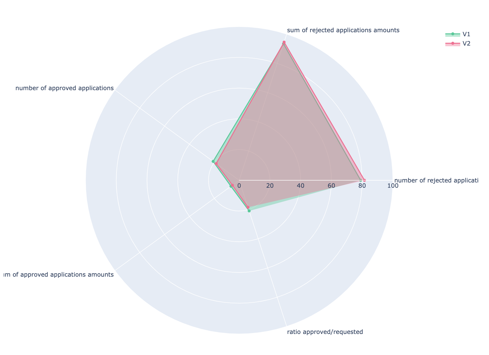

# Decisions Analytics

This repository first gathers decisions automated with ADS and ODM capabilities of the IBM Cloud Pak for Business Automation.
It encompasses Python Jupyter notebooks that apply data science to automated decisions to get business insights and to understand how business rules and ML models have participated to the decision making.

## Decision logics
We cover the following sample use cases:
   * Loan approval
   * Client loyalty program
   
## Gallery
A gallery of graphical views on business KPIs and decision automation logic coverages.

  
  
  
  
  
  
  
  
  
  
  

  All these screenshots are extracted from the notebooks shared below. Most of them are interactive inside the notebooks to navigate into the data.

## Datasets
For each business use case you find under [data](./data) the datasets of different sizes with the full decisions and the requests only.
Datasets are under ADS and ODM folder depending what tool has been used to automate the decisions.
Decisions and requests are serialized in JSON. For small sizes they are shared as regular files; And for larger ones they are shared in parquet. 

## Notebooks
Analyse decisions automated with Automation Decision Services through notebooks:
   * ADS
      * [Analyzing loan approvals](https://nbviewer.org/github/DecisionsDev/decisions-analytics/blob/main/notebooks/ADS/ads-loanvalidation-analytics.ipynb)
      * [Analyzing loyalty program decisions](https://nbviewer.org/github/DecisionsDev/decisions-analytics/blob/main/notebooks/ADS/ads-loyaltyprogram-analytics.ipynb)
      * [Comparing loan approvals with tasks : V1 vs V2](https://nbviewer.org/github/DecisionsDev/decisions-analytics/blob/main/notebooks/ADS/ads-22.0.1-loanapprovalwithtasks-v1-vs-v2-5K.ipynb)
   * ODM
      * [Analyzing loan approvals] https://nbviewer.org/github/DecisionsDev/decisions-analytics/blob/main/notebooks/ODM/odm-loanvalidation-simulation-analytics.ipynb

